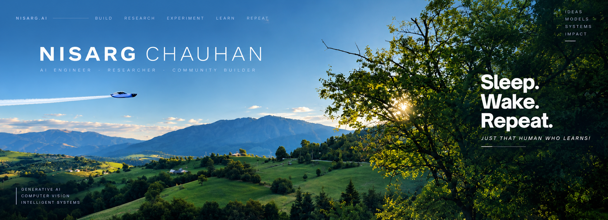
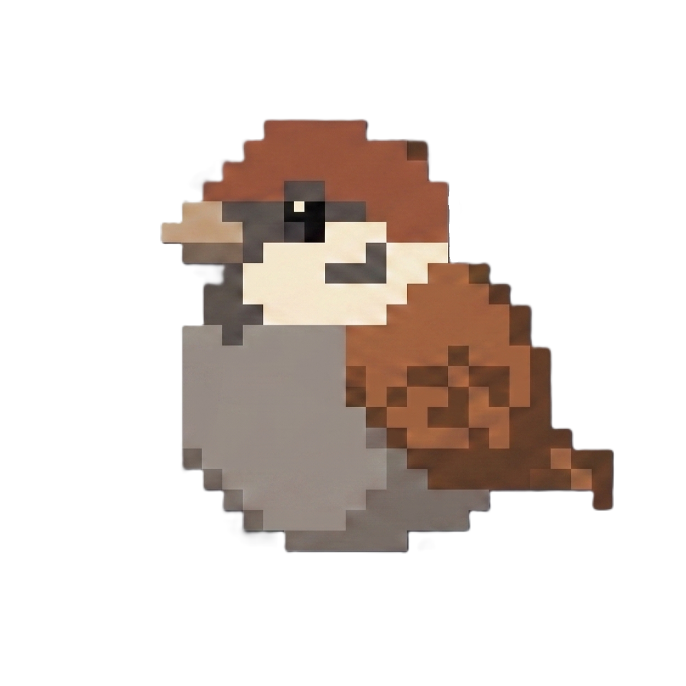

# Hey, I'm Nisarg.

**AI Engineer · Researcher · Community Builder**

Generative AI · Computer Vision · Intelligent Systems

[Portfolio](https://nisargchauhan.vercel.app/) · [LinkedIn](https://www.linkedin.com/in/that-nisarg/) · [GitHub](https://github.com/Nisar999)

---

## About

I build intelligent systems where **AI research meets real-world applications**.

Currently exploring **Generative AI, Computer Vision, LLMs, and intelligent systems**.

### PRISM

A personal project exploring what AI systems can become when they're built as systems—not just demos.

---

## Selected Work

**Air DJ** · Gesture Controlled Audio System  
Hand-gesture based audio control with a focus on responsive real-time interaction.

**Industrial Object Detection System**  
Computer vision models for detecting corrosion, fire extinguishers, and safety equipment.

**Craters & Boulders Detector**  
A computer-vision system for identifying craters and boulders in planetary exploration datasets.

**Netra** · Detection & Recognition System  
A full-stack, real-time face recognition and attendance system designed for multi-camera environments.

---

## Research

- **Integrated 4D Clinical Computational Taxonomy and Translation Roadmap for GAN-Based MRI Super-Resolution** — IEEE · Scopus
- **A Validated 4D Clinical-Computational Taxonomy and Translation Framework for GAN-Based MRI Super-Resolution** — IEEE · Scopus
- **Hierarchical Privacy-Preserving Federated Intrusion Detection for 6G Edge Networks** — IEEE · Scopus

---

**Sleep. Wake. Repeat.**

[Portfolio](https://nisargchauhan.vercel.app/) · [LinkedIn](https://www.linkedin.com/in/that-nisarg/) · [GitHub](https://github.com/Nisar999)

*Just That Human Who Learns!*

