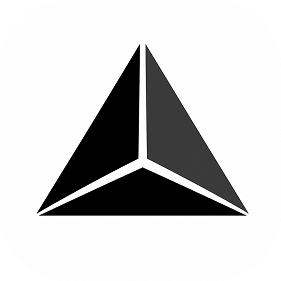

<!-- ======================= HEADER ======================= -->

  

<!-- ======================= INTRO ======================= -->

<h1 align="center">Hey, I'm Nisarg.</h1>

  <strong>AI Engineer · Researcher · Community Builder</strong>

  Generative AI · Computer Vision · Intelligent Systems

  <a href="https://nisargchauhan.vercel.app/">Portfolio</a>
  ·
  <a href="https://www.linkedin.com/in/that-nisarg/">LinkedIn</a>
  ·
  <a href="mailto:nisargchauhan777888@gmail.com">Email</a>

---

## About

> **Architecting intelligence, one model at a time.**

I'm an AI Engineer and researcher interested in turning
complex ideas into practical systems.

My work spans **Generative AI, Computer Vision, NLP,
Machine Learning and intelligent applications**, with a
particular interest in bridging research with real-world
engineering.

I enjoy building things from the ground up, experimenting
with emerging technologies, and learning through the
process.

---

## ⚡ Currently Building

  

<h3 align="center">PRISM</h3>

  <em>A personal AI system I'm building and evolving.</em>

PRISM is a private, long-term project exploring how AI,
models, tools and device capabilities can work together
as a cohesive system.

> Some projects are built to be demonstrated.  
> **Some are built to discover what's possible.**

  <strong>PRISM is the latter.</strong>

---

## 🧠 What I Work With

### Artificial Intelligence

`Generative AI` · `LLMs` · `Computer Vision` · `NLP`
`Deep Learning` · `RAG` · `Machine Learning`

### Engineering

`Python` · `TypeScript` · `JavaScript` · `C++`
`React` · `Next.js` · `Node.js`

### AI / ML Stack

`PyTorch` · `TensorFlow` · `OpenCV`
`MediaPipe` · `Scikit-learn`

### Cloud & Tools

`AWS` · `GCP` · `Docker` · `Git`

---

## 🚀 Selected Projects

### 🔭 Industrial AI Object Detection

Computer vision system for detecting corrosion,
fire extinguishers and safety equipment in industrial
environments.

**Python · YOLOv8 · OpenCV**

[View Project →](https://github.com/Nisar999/Industrial-AI-Object-Detection)

---

### 🪐 Planetary Crater Detection

Computer vision pipeline for detecting craters and
boulders from planetary exploration imagery.

**PyTorch · Mask R-CNN · GeoPandas**

[View Project →](https://github.com/Nisar999/Planetary-Crater-Detection)

---

### 🖐️ Indian Hand Sign Language Interpreter

Real-time gesture interpretation system designed to
translate hand signs through computer vision.

**TensorFlow · MediaPipe · React**

[View Project →](https://github.com/Nisar999/Hand-Sign-Language-Interpreter)

---

### 🎛️ AR-Based Audio Mixer

An augmented-reality audio interface where hand
gestures control frequency, speed, volume and bass.

**Python · OpenCV · MediaPipe**

[View Project →](https://github.com/Nisar999/AR-Based-Audio-Mixer)

---

### 👁️ Netra

A full-stack, real-time face recognition and attendance
monitoring system designed for multi-camera environments.

**Python · React · Node.js · Docker**

[View Project →](https://github.com/Nisar999/Netra)

---

### 📜 Certificate Management Platform

A platform for bulk certificate generation, ID creation
and mass mailing.

**React · Node.js · Python · GCP**

[View Project →](https://github.com/Nisar999/Certificate-Management-Platform)

---

## 🔬 Research

My research interests sit at the intersection of AI,
computer vision, generative models, privacy-preserving
systems and emerging computing technologies.

### Selected Publications

**Integrated 4D Clinical Computational Taxonomy and
Translation Roadmap for GAN-Based MRI Super-Resolution**

IEEE Xplore · Scopus

`DOI: 10.1109/ICVADV67766.2026.11469834`

---

**A Validated 4D Clinical-Computational Taxonomy and
Translation Framework for GAN-Based MRI Super-Resolution**

IEEE Xplore · Scopus

`DOI: 10.1109/ICSMILE69273.2026.11519125`

---

**Hierarchical Privacy-Preserving Federated Intrusion
Detection for 6G Edge Networks**

IEEE Xplore · Scopus

`DOI: 10.1109/RMKMATE69073.2026.11518859`

---

## 💼 Experience

**Sahana System Limited**

AI/ML Intern · 2026  
Data Management Intern · 2024

Worked across AI/ML projects, data pipelines,
visualization and multimedia models.

**Batwebs.com**

Data Science with Machine Learning Intern · 2023–2024

Worked with classification, regression, clustering
and data visualization.

---

## 🌐 Community & Leadership

### IEEE

**Executive Chair**  
Silver Oak University IEEE Student Branch

**IEEE Signal Processing Society Ambassador**

Former **Chairperson — IEEE Signal Processing Society SBC**

Former **Secretary — IEEE SIGHT**

### AWS

**Student Builder Group Leader**  
AWS Student Builder Group · Silver Oak University

> Building technology is only part of the journey.
> Building communities around it matters too.

---

## 🎓 Education

**M.Tech — Artificial Intelligence & Data Science**  
Parul University · 2026 – Present

**B.Tech — Computer Engineering, AI/ML Specialization**  
Silver Oak University · 2022 – 2026

---

## 🧩 A Few Things About Me

I like:

- Building AI systems from scratch
- Exploring local and generative AI
- Computer vision experiments
- Research that can become something practical
- Technology communities
- E-sports & gaming technology
- Music

And, occasionally...

> **Sleep. Wake. Repeat.**

---

## 🤝 Let's Connect

I'm always interested in interesting problems,
research collaborations, ambitious projects and
new things worth building.

  <a href="https://nisargchauhan.vercel.app/">
    Portfolio
  </a>
  ·
  <a href="https://www.linkedin.com/in/that-nisarg/">
    LinkedIn
  </a>
  ·
  <a href="mailto:nisargchauhan777888@gmail.com">
    Email
  </a>

  Just That Human Who Learns.

